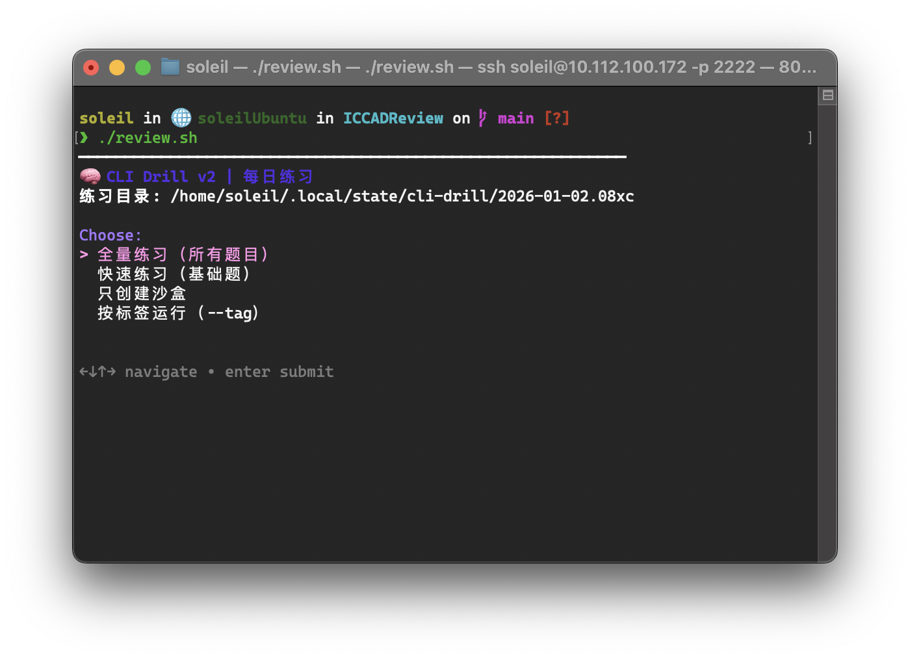

使用
```bash
sudo mkdir -p /etc/apt/keyrings                               
curl -fsSL https://repo.charm.sh/apt/gpg.key | sudo gpg --dearmor -o /etc/apt/keyrings/charm.gpg
echo "deb [signed-by=/etc/apt/keyrings/charm.gpg] https://repo.charm.sh/apt/ * *" | sudo tee /etc/apt/sources.list.d/charm.list

sudo apt update                                               
sudo apt install gum -y   
```

在ubuntu上安装gum，然后即可使用脚本，交互如下



